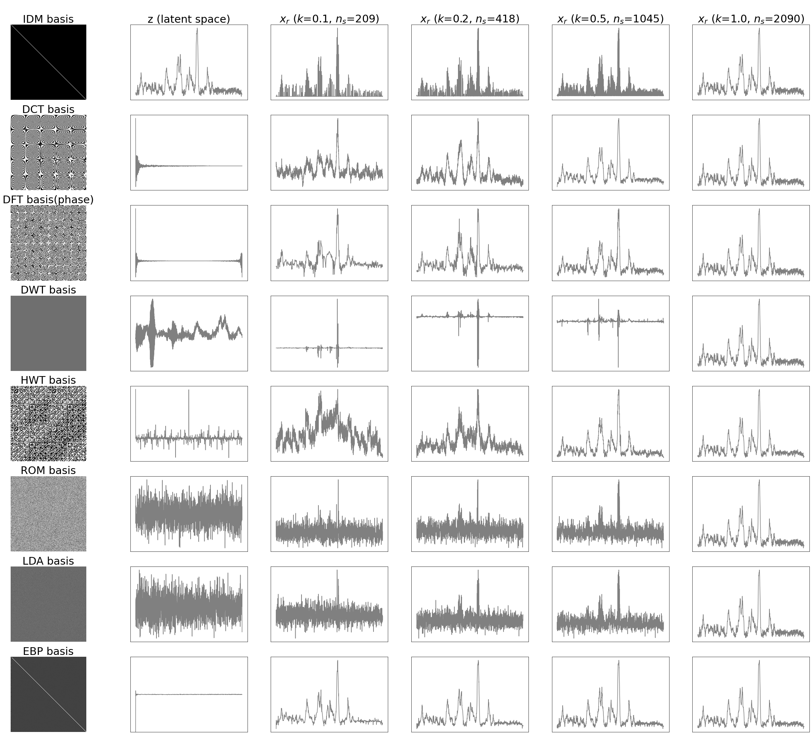

# cs1 

Compressed Sensing library for 1D (one-dimensional) Spectroscopic Profiling Data

<table>
    <thead>
        <tr>
            <th>package</th>
            <th>module</th>
            <th>sub-module</th>
            <th>description</th>
        </tr>
    </thead>
    <tbody>
        <tr>
            <td rowspan=9>cs1[3]</td>
        </tr>
        <tr>
            <td colspan = 2>cs1.cs</td>
            <td>basic functions for CS sensing, recovery, hyper-parameter grid-search, etc.</td>
        </tr>
        <tr>
            <td rowspan = 2>cs1.basis</td>
            <td>cs1.basis.common</td>
            <td>commonly used non-adaptive CS transform bases[1]</td>
        </tr>
        <tr>
            <td>cs1.basis.adaptive</td>
            <td>adaptive CS transform bases, e.g., LDA (linear discriminant analysis)-based, EBP (eigenvector-based projection)[2], VAE (variational auto-encoder)</td>
        </tr>
        <tr>
            <td colspan = 2
            >cs1.metrics</td>
            <td>CS-related metrics, e.g., mutual coherence, sparsity, MSE, KLD</td>
        </tr>
        <tr>
            <td>cs1.security</td>
            <td>cs1.security.tvsm</td>
            <td>time-variant sensing matrix mechanism[4]</td>
        </tr>
        <tr>
            <td rowspan = 2>cs1.domain</td>
            <td>cs1.domain.audio</td>
            <td>contains functions for audio and other one-dimensional signal processing. e.g., wave file I/O, lossy compression, ECG simulator</td>
        </tr>
        <tr>
            <td>cs1.domain.image</td>
            <td>contains functions for image processing. e.g., image CS, lossy compression</td>
        </tr>
        <tr>
            <td colspan = 2>cs1.gui</td>
            <td>provides a web-based playground for researchers. users can try different CS bases and sampling ratios</td>
        </tr>
    </tbody>
</table>

Publications:   
[1] Adaptive compressed sensing of Raman spectroscopic profiling data for discriminative tasks [J]. Talanta, 2020, doi: 10.1016/j.talanta.2019.120681   
[2]  Task-adaptive eigenvector-based projection (EBP) transform for compressed sensing: A case study of spectroscopic profiling sensor [J]. Analytical Science Advances. Chemistry Europe, 2021, doi: 10.1002/ansa.202100018  
[3] Compressed Sensing library for spectroscopic profiling data [J]. Software Impacts, 2023, doi: 10.1016/j.simpa.2023.100492  
[4] Secured telemetry based on time-variant sensing matrix – An empirical study of spectroscopic profiling, Smart Agricultural Technology, Volume 5, 2023, doi: 10.1016/j.atech.2023.100268
[5] Variational Auto-Encoder based Deep Compressed Sensing on Raman Spectroscopy [J]. Smart Agricultural Technology. 2025

# Installation

> pip install cs1

# A simple startup
    
    import cs1

    # Generate common non-adaptive bases and save to a local pickle file.
    # The generation process can be very slow, so save it for future use.
    cs1.basis.common.Generate_PSIs(n, savepath = 'PSIs_' + str(n) + '.pkl') # n is the data/signal dimensionality

    # load back bases
    file = open('PSIs_' + str(n) + '.pkl','rb')
    PSIs = pickle.load(file)
    file.close()

    # sparsity analysis
    cs1.metrics.analyze_sparsity(x, PSIs)

    # compare different bases and sampling ratio on a single sample
    mses, rmses = cs1.cs.GridSearch_Sensing_n_Recovery(x, PSIs, solver = 'LASSO') # returns MSEs and relative MSEs

# low-level cs functions
    
    from cs1.basis.common import *

    dftmtx()
    dctmtx()
    hwtmtx()

    from cs1.cs import *

    sensing()
    recovery()
    
    from cs1.metrics import *

    mutual_coherence()
    ...

# singal processing functions for audio / image domains

    from cs1.domain.audio import *

    simulate_ECG()
    dct_lossy_signal_compression()
    dft_lossy_signal_compression()

    from cs1.domain.image import *

    img_dct()
    img_dft()
    dct_lossy_image_compression()
    dft_lossy_image_compression()

# adaptive cs bases

    from cs1.basis.adaptive import *
    
    PSI, _ = EBP(X) # X is a m-by-n training dataset. PSI is the EBP basis
    PSI, _, _ = LDA(X, y, display = True) # X and y are training dataset. PSI is the LDA basis.

# run as a local web server

`python -m cs1.gui.run`

You can then access the web GUI at the 5006 port: 

